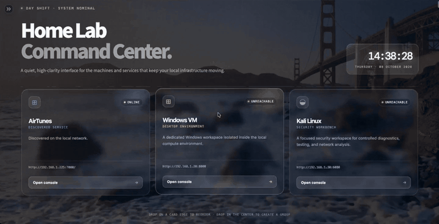
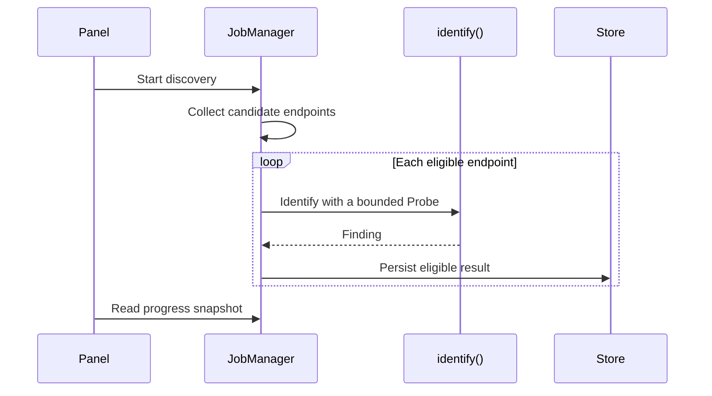
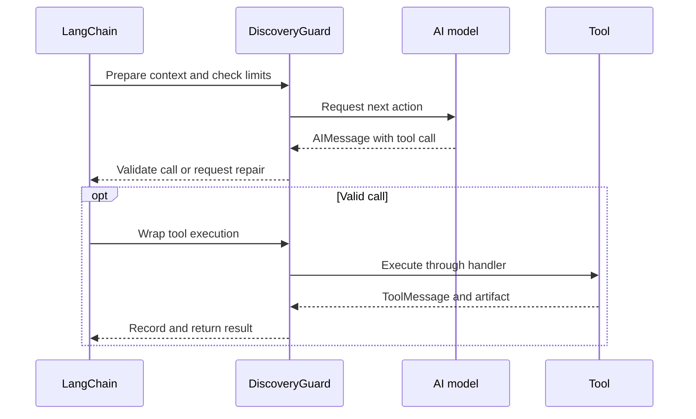
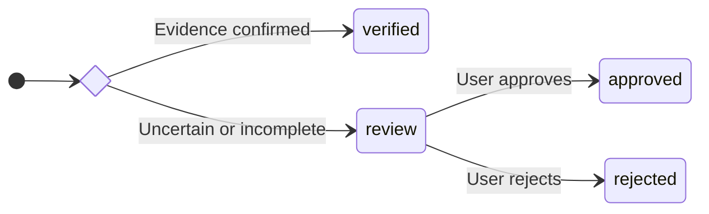

# ◈ Home Lab Command Center

**A simple, elegant dashboard for opening and keeping an eye on your home lab services.**

Home Lab Command Center brings your local web interfaces together in one place. Add a service once, then open it from its own card whenever you need it. The dashboard is built with Streamlit and runs on your computer or home server.

## ✨ What you can do

- Open a service such as AdGuard Home, Proxmox, a Windows VM, or Kali Linux in a new browser tab.
- Add, edit, and remove service cards from the sidebar.
- Drag cards to reorder them, or drop one service onto another to create a named group.
- Check whether a service's network port accepts connections.
- See the current time without refreshing the page.
- Use the dashboard on desktop, tablet, or phone.
- Enjoy a time-aware, muted Golden Gate video background with a frosted-glass interface.
- Run a Gemini-powered agent to discover local web services, automatically add verified results, and review uncertain matches.

## 🌗 Day and night appearance

The dashboard changes its accent color and day/night label automatically using the **local time on the computer or server running the app**:

| Local time | Appearance |
| --- | --- |
| 06:00–17:59 | Day Shift with a warm amber accent |
| 18:00–05:59 | Night Shift with a soft violet accent |

Chrome, Firefox, and Edge use the day or night background video for the current time. Both files contain video only (their audio tracks were removed), play automatically, and loop continuously. Safari uses the original static Golden Gate photograph for reliable rendering without media controls.

## 🖥️ Dashboard preview

The dashboard pairs a live service overview with a frosted-glass interface and a gently animated Golden Gate backdrop.

[](readme-assets/dashboard-demo.mp4)

*19-second demo: reorder cards, create and rename a group, and drag a service back out. [Watch the MP4](readme-assets/dashboard-demo.mp4).*

[](readme-assets/dashboard-night-demo.mp4)

*10-second nighttime demo: rearrange services inside a group and return them to the dashboard against the animated night backdrop. [Watch the night MP4](readme-assets/dashboard-night-demo.mp4).*


*The main dashboard with the sidebar collapsed.*


*The sidebar expanded for endpoint settings and service management.*

## 🚀 Get started

### Prerequisites

- Gemini or Groq API key for AI discovery.
- Nmap for subnet scans (not needed for individual URLs).

### Proxmox LXC quick setup

In a fresh Debian LXC, clone the repository and run the included installer as
root:

```bash
apt-get update && apt-get install -y git
git clone https://github.com/wgrzyb271/GlassScout.git
cd GlassScout
bash scripts/setup_proxmox_lxc.sh
```

Use `bash scripts/setup_proxmox_lxc.sh --with-browser` to also install the
optional Chromium renderer. The installer creates the `glassscout` account,
virtual environment, boot-enabled systemd service, encrypted credential store
and optional hidden API-key prompts. Re-running it updates the application but
keeps saved dashboard data.

### 1. Install Python

Install **Python 3.10 or newer**. On macOS or Linux, `python3 --version` should print your installed version. On Windows, use `py --version`.

### 2. Clone the repository

```bash
git clone https://github.com/wgrzyb271/GlassScout.git
cd GlassScout
```

### 3. Create an environment and install the app

#### macOS / Linux

```bash
python3 -m venv .venv
source .venv/bin/activate
python -m pip install -r requirements.txt
```

#### Windows PowerShell

```powershell
py -m venv .venv
.venv\Scripts\Activate.ps1
python -m pip install -r requirements.txt
```

### 4. Start the dashboard

```bash
python -m streamlit run app.py
```

Open the local address shown in the terminal, usually <http://localhost:8501>. To stop the app, return to the terminal and press **Ctrl+C**.

## 🧩 Add your services

1. Open **Add service** in the sidebar.
2. Enter a name and URL. Category, description, icon, and accent color are optional presentation details.
3. Select **Add to dashboard**. The new card appears with the others.
4. To change a service URL later, edit it in **Service Endpoints** and select **Save endpoint changes**.
5. To edit a card, open **Manage services → Modify**, change its name, URL, category, description, icon or accent, then select **Save changes**. **Cancel** discards the edits.
6. To remove a card, open **Manage services** and select **Remove** beside it.

The sidebar keeps **Service endpoints** collapsed by default so a large service
list remains manageable. Open **Service backup** to download a versioned JSON
backup or restore one. Restoring validates the complete file before replacing
the current service list.

There is no fixed dashboard service limit. **Manage services** becomes scrollable when the list is longer than six entries. On the main multi-column grid, drag a card onto the left or right edge of another card to change its order; drop it in the center to create an iOS-style group. A one-column layout uses the top and bottom edges instead. Glass groups preview each service icon and name. Select a group to rename it, open its full service cards, or reorder them with the same drag gesture. Drag a service to the removal area above the group to place it back on the main dashboard. Card order and groups are stored locally in `data/layout.json`.

Your service list is saved locally in `data/services.json` and is kept when you restart the app. Use URLs that your browser can reach, for example `http://192.168.1.20:8080` or `https://proxmox.example.local:8006`.

## 🟢 About the connection status

Turn on **Check node heartbeat** to check whether each service's host and TCP port accept a connection. `ONLINE` means the port accepted the connection; `UNREACHABLE` means it did not. This does **not** sign in, load the service's web page, or check whether the application itself is healthy. With the option off, cards show `LINK READY` instead.

## 🔎 Discover services automatically

Open **Discover services** in the sidebar to find web applications on your local network. The agent reads your computer's network settings, collects service responses, and uses Gemini or Groq to identify applications even when they use nonstandard ports.

The API key is configured only on the server and is never rendered in the
dashboard. For local development, set `GROQ_API_KEY` or `GEMINI_API_KEY` in the
process environment. A systemd deployment should use an encrypted service
credential as described in `docs/deploy-discovery-lxc.md`.

Copy `.streamlit/secrets.toml.example` to `.streamlit/secrets.toml` for
non-secret provider and model settings:

```toml
LLM_PROVIDER = "groq"

GROQ_MODEL = "openai/gpt-oss-120b"

GEMINI_MODEL = "gemini-3.6-flash"
```

At runtime, systemd credentials take precedence over environment variables and
the Streamlit file. **Delete history → Confirm deletion** removes past runs,
findings, and activity events without deleting service cards.

### What happens to the results?

- **Verified:** a matching panel and separate machine-readable identity are checked again before the service is added automatically. Known router firmware can also be verified by matching product-specific markers in its panel and a separate JS/CSS/JSON resource, or by a freshly repeated redirect from the router address to a separately fetched branded login panel. A single brand name or server header is not enough. Repeated discoveries of the same named panel on one device collapse into one card; HTTPS is preferred when both HTTP and HTTPS work.
- **Needs review:** inspect the proposed name, URL, evidence, and reason for uncertainty. Open the panel, then approve, correct, or reject the suggestion.
- **Rejected:** unchanged rejected suggestions stay dismissed on subsequent runs. Manual approvals are remembered too.

### More complete discovery

Before using AI, the scanner follows up to three observed same-origin HTTP,
HTML meta-refresh or literal JavaScript redirects. It reads page metadata,
login-page links and identifying response headers. Proxmox VE, AdGuard Home
and common router firmware signatures can be recognized locally when the
evidence agrees. Titles that explicitly identify an unknown router, gateway or
firewall vendor are also considered. Automatic addition still requires a
second resource or an observed redirect and a fresh verification; no scanner
can guarantee identification of every router or authenticated panel.

**Identify protocols before checking web panels** enables Nmap's light service
detection. Confirmed SSH, SMB and other non-web protocols are skipped; unknown
ports are still checked. This takes longer than a port-only scan.

After an API quota, time limit or endpoint limit interrupts discovery, open
**Discover services → Resume remaining addresses** to process the saved queue
without repeating the subnet scan. If TCP port coverage itself was interrupted,
choose **Resume unfinished port scan**. Full port ranges are scanned in persisted
batches, so only the interrupted batch may be repeated after a restart.
This also works after restarting the app.
Choose the provider and limits again. It resumes addresses, not earlier model
conversations. The queue holds up to 256 deferred addresses plus the current
batch; it cannot recover hosts that Nmap never finished scanning. Wait for the
provider's quota reset or select another provider before resuming a quota failure.

Before a subnet scan, **Skip active saved endpoints** performs a short TCP check
of every saved local IP and port. Reachable pairs are not analyzed again, while
other ports on the same device remain eligible. Confirmed non-web protocols are
discarded, but real HTTP panels—including printer pages on HTTP, HTTPS or IPP—are
still kept for identification.

Use **Scan entire network** for a one-click exhaustive scan of TCP ports
`1-65535` on the selected LANs. This mode has no scan-time, endpoint, or aggregate
model-input cutoff and continues through every persisted port batch and discovered
address until it finishes or **Stop scan** is selected. When the provider reports
an AI rate limit, the run waits for the advertised reset and retries the same
address. Per-service safety bounds still apply. A non-quota provider failure does
not stop TCP coverage; its unfinished service-address queue remains resumable.
Port scanning and service identification
run as a producer/consumer pipeline: newly discovered addresses are checked and
cards are saved while Nmap continues with later batches. The dashboard shows
separate live progress bars for completed port batches and checked addresses.

### Optional JavaScript rendering

For unresolved panels requiring JavaScript, install the optional browser tools
in the application's environment:

```bash
python -m pip install -r requirements-browser.txt
python -m playwright install chromium
```

On Debian, also install browser OS dependencies as root with that environment's
`python -m playwright install-deps chromium`. Download Chromium as the account
running the dashboard. For the LXC installation under `/opt/glassscout/app`:

```bash
runuser -u glassscout -- /opt/glassscout/app/.venv/bin/pip install -r /opt/glassscout/app/requirements-browser.txt
/opt/glassscout/app/.venv/bin/python -m playwright install-deps chromium
runuser -u glassscout -- /opt/glassscout/app/.venv/bin/python -m playwright install chromium
systemctl restart glassscout
```

Enable **Advanced scan settings → Render unresolved pages with a browser**.
The browser uses a fresh context, a sandbox and a bounded rendering time. It
does not log in, submit forms or send POST requests. Same-origin requests use
the scanner's fixed-IP transport. External resources, WebSockets, service
workers and URLs with query strings are blocked, so some panels still require
manual review. If Chromium or its sandbox cannot start, HTTP discovery continues
and the activity log records the failure.

## 🧭 How it works

### Discovery flow



### Agent step



### Verification and review



## 🧪 Try a fake service

Start a separate terminal in the project directory and activate your environment, then run:

```bash
python -m devtools.fake_service --scenario normal --port 0
```

The terminal prints a local URL with an automatically selected free port. Paste it into **Extra / test URLs**, deselect the subnets to test just that URL, verify that the selected provider is configured on the server, and run the agent. The test server itself requires only Python; the discovery agent requires the packages listed above. Stop the server with **Ctrl+C**.

| Scenario | What it tests |
| --- | --- |
| `normal` | Consistent page and identity API, suitable for automatic verification |
| `unknown` | Generic sign-in page that needs manual review |
| `conflict` | A Proxmox title contradicted by the identity API |
| `redirect-loop` | Repeated redirects and no-progress limits |
| `slow` | Request timeouts |
| `error` | An unavailable service returning HTTP 503 |
| `injection` | Page text attempting to redirect the agent outside the permitted target |

To make the fixture reachable from another device on your LAN, add `--host 0.0.0.0` and use the test machine's LAN address. Choose a fixed `--port` to compare scenarios at the same endpoint.

Offline tests and implementation notes are described in [the development guide](docs/development.md).

Sanitized discovery failures are saved locally as JSON-formatted `.err` files in `data/discovery/errors/`. API keys, tokens, credentials, email addresses, and provider organization identifiers are redacted before writing.

## 📋 Requirements

- Python 3.10 or newer
- Streamlit (installed from `requirements.txt`)
- Discovery packages from `requirements.txt` and a Gemini API key for the agent
- Nmap for subnet scans (not needed for an individual test URL)
- A modern web browser
- Network access during the initial dependency installation

The dashboard uses the included local photo, so it does not need an external image service. Manual service management works locally without an account. Gemini discovery additionally requires internet access and a Google API key.
