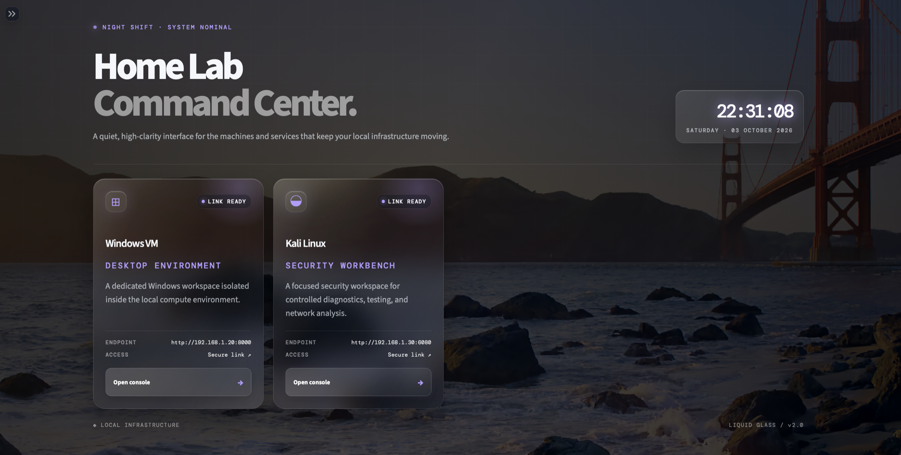
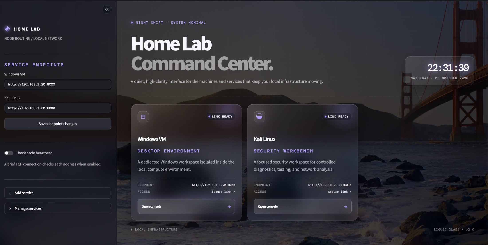
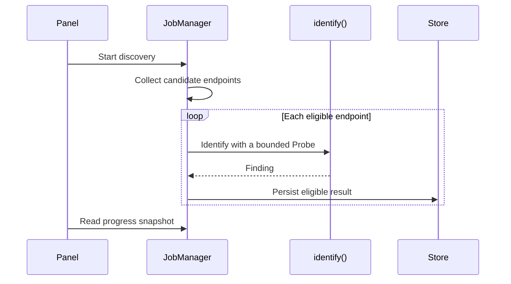
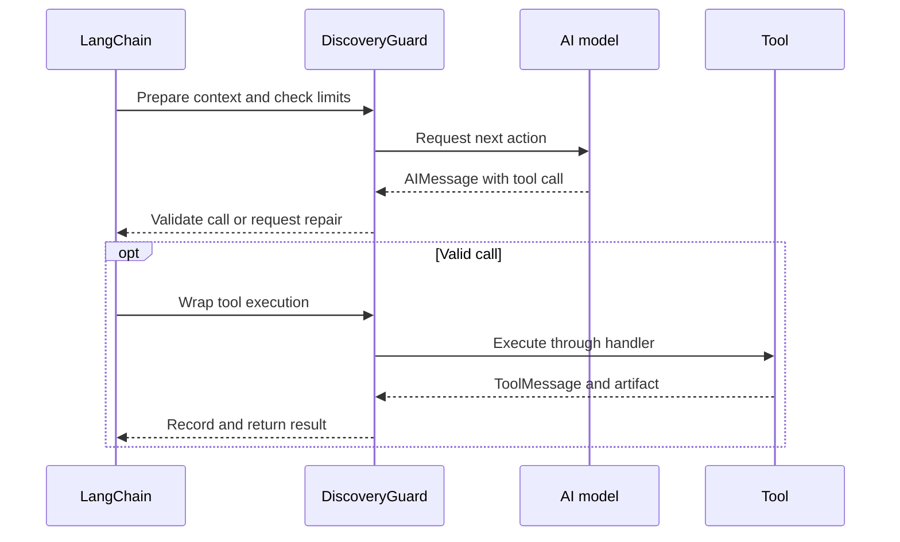
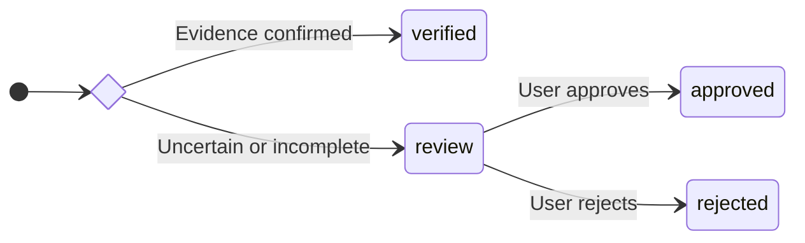

# ◈ Home Lab Command Center

**A simple, elegant dashboard for opening and keeping an eye on your home lab services.**

Home Lab Command Center brings your local web interfaces together in one place. Add a service once, then open it from its own card whenever you need it. The dashboard is built with Streamlit and runs on your computer or home server.

## ✨ What you can do

- Open a service such as AdGuard Home, Proxmox, a Windows VM, or Kali Linux in a new browser tab.
- Add, edit, and remove service cards from the sidebar.
- Drag cards to reorder them, or drop one service onto another to create a named group.
- Check whether a service's network port accepts connections.
- See the current time without refreshing the page.
- Use the dashboard on desktop, tablet, or phone.
- Enjoy a gently animated Golden Gate background with a frosted-glass interface.
- Run a Gemini-powered agent to discover local web services, automatically add verified results, and review uncertain matches.

## 🌗 Day and night appearance

The dashboard changes its accent color and day/night label automatically using the **local time on the computer or server running the app**:

| Local time | Appearance |
| --- | --- |
| 06:00–17:59 | Day Shift with a warm amber accent |
| 18:00–05:59 | Night Shift with a soft violet accent |

The background photo moves slowly with a subtle pan and zoom. If your device has **Reduce motion** enabled, the background animation is paused.

## 🖥️ Dashboard preview

The dashboard pairs a live service overview with a frosted-glass interface and a gently animated Golden Gate backdrop.



*The main dashboard with the sidebar collapsed.*



*The sidebar expanded for endpoint settings and service management.*

## 🚀 Get started

### Prerequisites

- Gemini or Groq API key for AI discovery.
- Nmap for subnet scans (not needed for individual URLs).

### 1. Install Python

Install **Python 3.10 or newer**. On macOS or Linux, `python3 --version` should print your installed version. On Windows, use `py --version`.

### 2. Clone the repository

```bash
git clone https://github.com/wgrzyb271/GlassScout.git
cd GlassScout
```

### 3. Create an environment and install the app

#### macOS / Linux

```bash
python3 -m venv .venv
source .venv/bin/activate
python -m pip install -r requirements.txt
```

#### Windows PowerShell

```powershell
py -m venv .venv
.venv\Scripts\Activate.ps1
python -m pip install -r requirements.txt
```

### 4. Start the dashboard

```bash
python -m streamlit run app.py
```

Open the local address shown in the terminal, usually <http://localhost:8501>. To stop the app, return to the terminal and press **Ctrl+C**.

## 🧩 Add your services

1. Open **Add service** in the sidebar.
2. Enter a name and URL. Category, description, icon, and accent color are optional presentation details.
3. Select **Add to dashboard**. The new card appears with the others.
4. To change a service URL later, edit it in **Service Endpoints** and select **Save endpoint changes**.
5. To edit a card, open **Manage services → Modify**, change its name, URL, category, description, icon or accent, then select **Save changes**. **Cancel** discards the edits.
6. To remove a card, open **Manage services** and select **Remove** beside it.

There is no fixed dashboard service limit. **Manage services** becomes scrollable when the list is longer than six entries. On the main multi-column grid, drag a card onto the left or right edge of another card to change its order; drop it in the center to create an iOS-style group. A one-column layout uses the top and bottom edges instead. Glass groups preview each service icon and name. Select a group to rename it, open its full service cards, or reorder them with the same drag gesture. Drag a service to the removal area above the group to place it back on the main dashboard. Card order and groups are stored locally in `data/layout.json`.

Your service list is saved locally in `data/services.json` and is kept when you restart the app. Use URLs that your browser can reach, for example `http://192.168.1.20:8080` or `https://proxmox.example.local:8006`.

## 🟢 About the connection status

Turn on **Check node heartbeat** to check whether each service's host and TCP port accept a connection. `ONLINE` means the port accepted the connection; `UNREACHABLE` means it did not. This does **not** sign in, load the service's web page, or check whether the application itself is healthy. With the option off, cards show `LINK READY` instead.

## 🔎 Discover services automatically

Open **Discover services** in the sidebar to find web applications on your local network. The agent reads your computer's network settings, collects service responses, and uses Gemini or Groq to identify applications even when they use nonstandard ports.

Enter the API key in the sidebar, set matching environment variables, or copy `.streamlit/secrets.toml.example` to `.streamlit/secrets.toml`. The config file can select the provider and model as well as hold the API keys:

```toml
LLM_PROVIDER = "groq"

GROQ_API_KEY = "your-groq-api-key"
GROQ_MODEL = "openai/gpt-oss-120b"

GEMINI_API_KEY = "your-gemini-api-key"
GEMINI_MODEL = "gemini-3.6-flash"
```

That secrets file is ignored by Git. Environment variables override values from the file, while a value entered in the sidebar is held in memory and is not written into reports. The **Delete discovery history** button removes past runs, findings, and activity events without deleting service cards.

### What happens to the results?

- **Verified:** a matching panel and separate machine-readable identity are checked again before the service is added automatically. Repeated discoveries of the same panel update its existing entry rather than create a duplicate.
- **Needs review:** inspect the proposed name, URL, evidence, and reason for uncertainty. Open the panel, then approve, correct, or reject the suggestion.
- **Rejected:** unchanged rejected suggestions stay dismissed on subsequent runs. Manual approvals are remembered too.

## 🧭 How it works

### Discovery flow



### Agent step



### Verification and review



## 🧪 Try a fake service

Start a separate terminal in the project directory and activate your environment, then run:

```bash
python -m devtools.fake_service --scenario normal --port 0
```

The terminal prints a local URL with an automatically selected free port. Paste it into **Extra / test URLs**, deselect the subnets to test just that URL, enter your Gemini API key, and run the agent. The test server itself requires only Python; the discovery agent requires the packages listed above. Stop the server with **Ctrl+C**.

| Scenario | What it tests |
| --- | --- |
| `normal` | Consistent page and identity API, suitable for automatic verification |
| `unknown` | Generic sign-in page that needs manual review |
| `conflict` | A Proxmox title contradicted by the identity API |
| `redirect-loop` | Repeated redirects and no-progress limits |
| `slow` | Request timeouts |
| `error` | An unavailable service returning HTTP 503 |
| `injection` | Page text attempting to redirect the agent outside the permitted target |

To make the fixture reachable from another device on your LAN, add `--host 0.0.0.0` and use the test machine's LAN address. Choose a fixed `--port` to compare scenarios at the same endpoint.

Offline tests and implementation notes are described in [the development guide](docs/development.md).

Sanitized discovery failures are saved locally as JSON-formatted `.err` files in `data/discovery/errors/`. API keys, tokens, credentials, email addresses, and provider organization identifiers are redacted before writing.

## 📋 Requirements

- Python 3.10 or newer
- Streamlit (installed from `requirements.txt`)
- Discovery packages from `requirements.txt` and a Gemini API key for the agent
- Nmap for subnet scans (not needed for an individual test URL)
- A modern web browser
- Network access during the initial dependency installation

The dashboard uses the included local photo, so it does not need an external image service. Manual service management works locally without an account. Gemini discovery additionally requires internet access and a Google API key.
